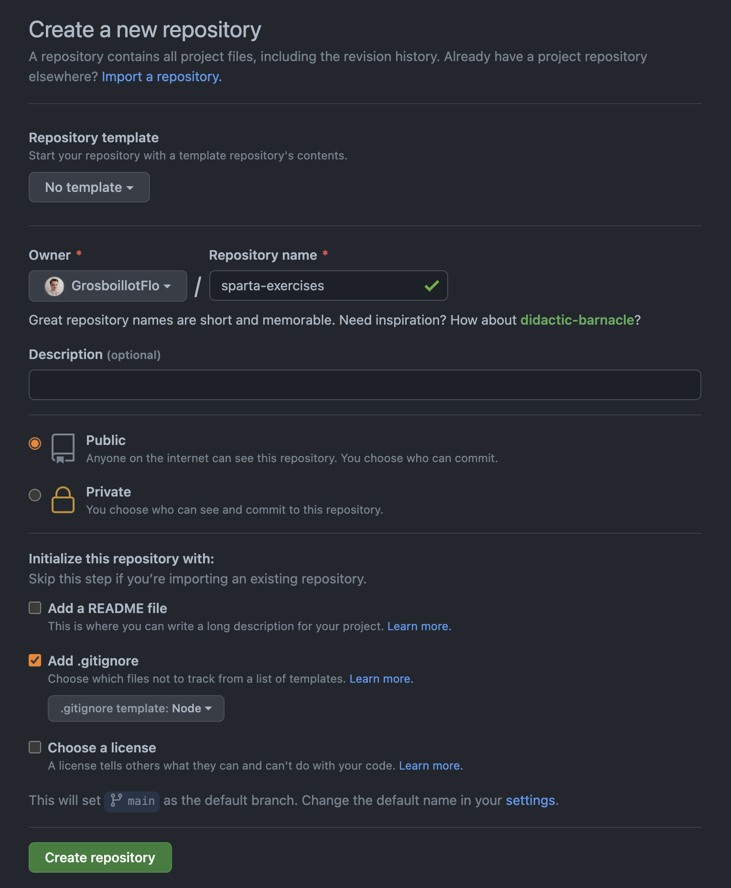

# Getting started

## Sparta CLI

`sparta-cli` is a Brew package that will allow you to manage the exercises repository during the bootcamp.

### Installation

You should be able to use the command line `sparta help`. Try it:

```shell
$ sparta help

Sparta CLI

VERSION
  sparta/1.0.0 darwin-x64 node-v12.16.2

USAGE
  $ sparta [COMMAND]

COMMANDS
  help   display help for sparta
  init   Initializes the Sparta workspace
  sync   Updates all the exercises for the past days
  test   Launch the tests for an exercise
  today  Downloads the exercises for the current day
```

> As you can see, you have 5 available commands!

If this command does not return with something like this, run:

```shell
$ brew install fewlines-education/tap/sparta-cli
```

And try again.

### Exercises repository creation

To start, go to the settings page of Sparta and copy the `sparta init` line, it should look like this:

```shell
$ sparta init --batchID=<weird_string> --userID=<weird_string>
Enter the Sparta secret token: <secret_token>

You will be asked to create a blank github repository with a `.gitignore` file at its root, do it like this:
````



Go the newly created `/Users/<your_name>/workspace/fewlines-education/exercises` directory and add the `git remote`, as asked in the instructions.

Then, in the `.gitignore` file, add the following:

```shell
*.DS_Store
node_modules
```

Now, it's time to commit this change:

```shell
$ git add .gitignore

$ git status # Check that only the .gitignore is added

$ git commit -m "exercises repo creation"

$ git push origin main
```

### Get the exercises for the day

Each day you will have to download the exercises for the current day. To do it:

```shell
$ sparta today
```

🔎 Then, look inside your `exercises` directory! 🔎

```shell
exercises
└── 02_programming_fundamentals
    └── 01_variables
```

`01_variables` is the folder you need to use today.
Inside, you'll have a directory named **`current`**, navigate to it and see what you have to do today:

```shell
exercises
└── 02_programming
    └── 01_variables
        └── current 👈 # HERE!
             ├── 00_getting_started
             ├── 01_play_with_strings
             ├── 02_play_with_numbers
             ├── 03_play_with_objects_and_arrays
             ├── 04_play_with_length
             ├── 05_play_with_slice
             ├── 06_play_with_charat
             ├── 07_play_with_uppercase
             ├── 08_play_with_capitalized_strings
             ├── 09_play_with_arrays
             ├── 10_play_with_push
             └── 11_play_with_join
```

## Context and Objectives

This exercise is an introduction to solving efficiently exercises.

## Specs

With your terminal, navigate with the command `cd wantedFolder` to enter a folder.
You can then navigate to the exercise folder which usually starts with a number, followed by the name of the exercise.

**Note**: Use the command `ls` in your terminal to see a list of all the files and folders at your current location.

In the `src` folder, open the `index.js` file and code the following specifications:

- The variable `booleanVariable` must be given a boolean value `true`;
- Uncomment the ligne `// const nullVariable = null;` by deleting the characters `//`;
- The variable `greetingVariable` must be given the string value `"Hello World!"`.

Once you are done, you can launch tests by executing the command `yarn test` from the exercise folder.

Once the tests are all passed, you can move on to the next exercise!
Don't hesitate to ask for help to your teachers!

Have fun!!
