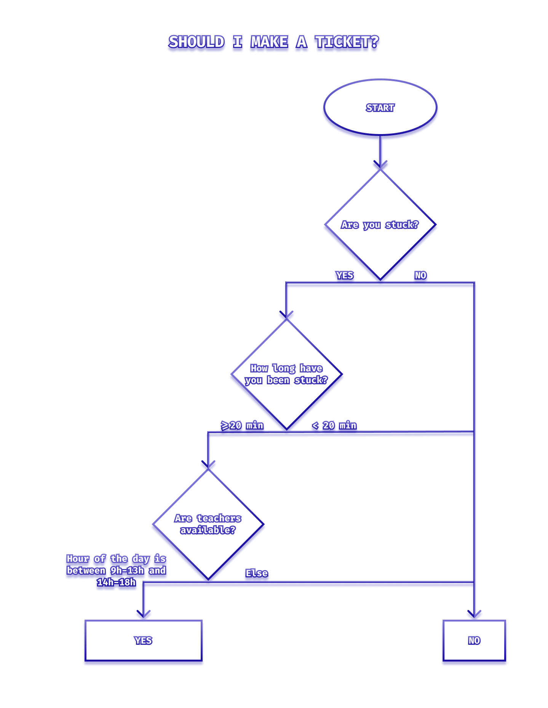

# Fundamental flowchart copy

## Context and Objectives

Flowcharts are tools that can be used to help developers visualising an algorithm they are building.
Use the decision flowchart below to build a function that behaves the same way!

## Specs

### Introducing yourself



Code the function `shouldIMakeATicket` to represent the same flow as the chart above. The function should return a `boolean`.

You have access to the following three parameters:

- `isStuck` which is a boolean.
- `timeBeingStuck` which is a number representing the number of minutes you have been stuck.
- `hoursOfTheDay` which is a number representing the hour of the day.

You should only use `if` / `else` statements to control your function with those three parameters.

## Testing

As usual, run the tests with `yarn test` and feel free to play with your code by executing `yarn start`.

### Example

```js
const answerOne = shouldIMakeATicket(true, 35, 10);

console.log(answerOne);
// Should console log "true"

const answerTwo = shouldIMakeATicket(true, 5, 15);

console.log(answerTwo);
// Should console log "false"
```
