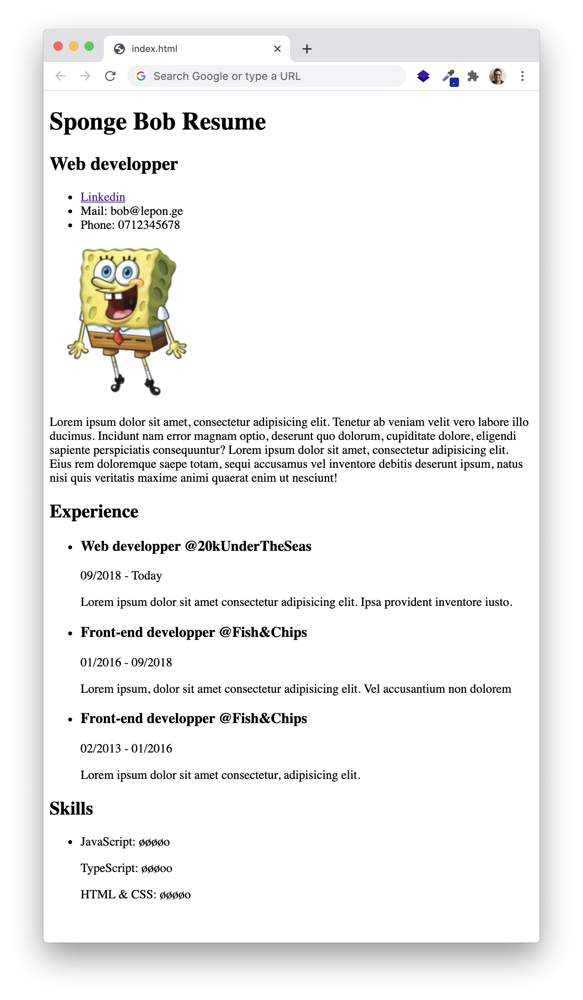

# Building your resume

## Context and Objectives

Now that we’ve done some HTML & CSS, let’s combine all that we’ve learned on a litlle project: Your personal web resume!

Personal websites are a great way to show in a creative and technical way what you are capable of. Let’s go through it step by step.

## Specs

⚠️ There are **no tests** BUT you must commit your resume by the end of the day so that we can have a look at it.

To start with your resume:
- create a `html-resume` folder in your `Workspace` directory.
- create a `index.html` file in the `html-resume` folder.
- in the terminal, enter `open html-resume/index.html` to see the render of the file in your default web browser. When you make changes, reload the page to see them applied: `⌘ + r`.

### Part 1: HTML resume

Time to build your resume.

- Insert your first and last name as a main title.
- Insert your job(s) title(s) as a secondary title.
- Insert a profile picture to show the world how you want them to see you!
- Build a list that will recap all your professional experiences.

We forgot to introduce ourselves! On top of the list, create a paragraph of introduction describing who you are.

Add a line to separate your introduction from the list, to give it a little design look.

Social media and interconnection are important. Be sure to include at least one link to your profile from different social media websites (linkedin, instagram, google+, msn, myspace, skyrock, …)!

Under your list of experiences, show off some of your skills.

At the end of this step, it should look like a **word document without any style**, pretty much like this:

### Part 2: Add some style!

First impressions are important.

Now that you have the base information about you written in bare naked HTML, it's time to add some CSS style.

Go wild!

Experiment with [CSS](https://developer.mozilla.org/en-US/docs/Web/CSS/CSS_Properties_Reference)!

Here's an exemple of what you can do:

> Welcome to the past 😁

### Part 3: Positioning

Maybe you want to have your profile image in the top left corner? Or get thoses stars aligned on the right?

For all this kind of stuff, there is a useful tool: [flexbox](https://developer.mozilla.org/en-US/docs/Web/CSS/CSS_Flexible_Box_Layout/Basic_Concepts_of_Flexbox)! Read the doc, then try it!

### Part 4: Responsive design

Time to show off what you can do!

Changing the size of your web page might have a strong impact on the readability of your website.

Nowadays, readers are cross-platform when it comes to screen sizes!

Thankfully we have [media queries](https://developer.mozilla.org/fr/docs/Apprendre/CSS/CSS_layout/Media_queries) for that.

Have also a look at [pseudo-selectors](https://developer.mozilla.org/en-US/docs/Web/CSS/Pseudo-classes).
