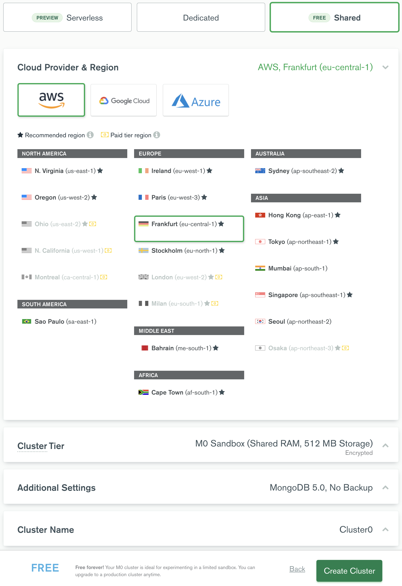
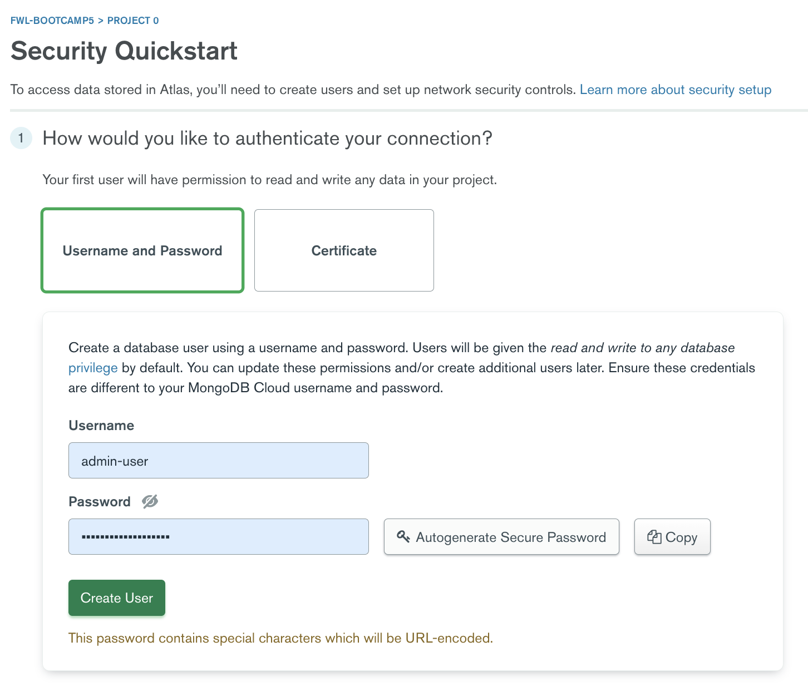
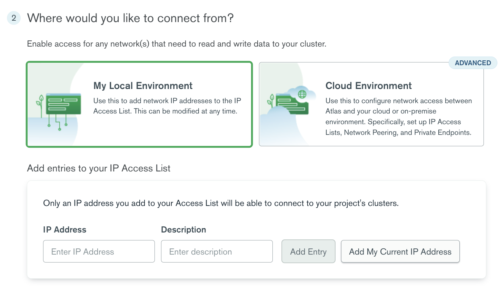
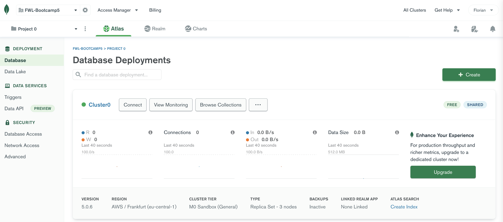
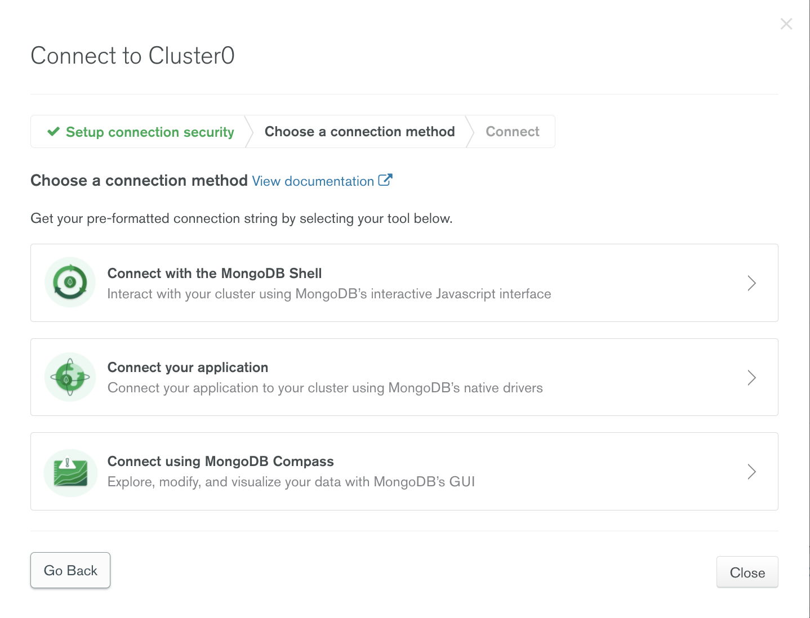
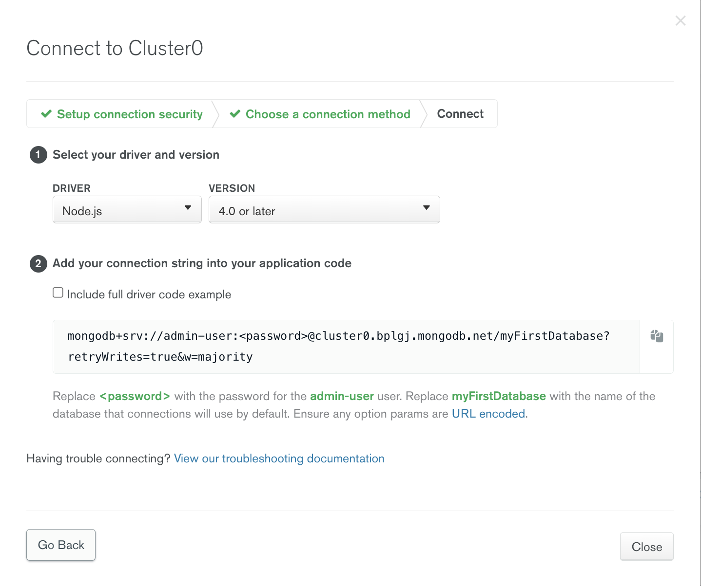

# Create a database on Atlas

## Context and objectives

We need a place to store our data.

We could have installed MongoDB directly on our computer but it would mean update the installation regularly, clean it to avoir having hundreds of unused databases, etc...

To ease the process and make our databases reachable from anywhere we want, we will use MongoDB Atlas rather than a local MongoDB instance.

## Specs

Once you created your account on https://www.mongodb.com/atlas/database, follow these steps to get a working database for your exercises.

### First steps

After having verified your email address, complete the first form ("*Welcome to Atlas! Tell us a few things about yourself and your project.*") without too much fear: this information is only indicative and will not affect the next steps and you can always change this later.

On the "*Deploy a cloud database*" page, be sure to choose the free option ("*Free / Shared*")

### Create a Shared Cluster

A cluster is a swarm of database. You can have a single on inside or have multiple databases. For now, let's start with one cluster creation:



> - For the courses we chose **AWS** (Amazon Web Services) and the Frankfurt region, because it is close to us.
>
> - You can change the cluster's name if you want (Optional).
>
> - It's time to create the cluster!

### Security

#### Create a user

To access data stored in Atlas, you’ll need to create users and set up network security controls:



> Your first user will have permission to read and write any data in your project.
>
> It is advised to generate a complex password with the dedicated `Autogenerate Secure Password` button.
> **SAVE THIS PASSWORD SOMEWHERE, YOU WILL NEED IT.** If you forgot to do it, don't worry too much since you can edit it later.
>
> You can update these permissions and/or create additional users later. Ensure these credentials are different to your MongoDB Cloud username and password!

#### Where to connect from?

We need to indicate where to connect from to enable access for any network(s) that need to read and write data to your cluster.



> Select "My Local Environment"
>
> Then Add your current IP adress

Let's go to your database! 👍

### Contact the cluster

Now you have a working cluster, it is time to contact it with your code.



> It may take some time for your cluster to initialized

You can then choose a connection method. Here, we need to connect the Application (the tests files) to check if your database url is the good one:





### Add the url to the code

Keep only this part of your url, without the database name:

```shell
mongodb+srv://<your-username>:<your-password>@cluster0.djg4e.mongodb.net/
```

Then, in order to use it in your code, you need to make it and environment variable:
- 1️⃣ Create a `.env` file
- 2️⃣ **BE EXTRA SURE** that it is added to your `.gitignore` file to avoid revealing your password on Github on a push.
- 2️⃣ **BE EXTRA SURE** that it is added to your `.gitignore` file to avoid revealing your password on Github on a push.
- 2️⃣ **BE EXTRA SURE** that it is added to your `.gitignore` file to avoid revealing your password on Github on a push.
- 3️⃣ add the database url in the `.env` file:

  ```shell
  MONGODB_DATABASE_URL='mongodb+srv://<your-username>:<your-password>@<cluster-name>.djg4e.mongodb.net/'
  ```
  > Change the placeholders with your own credentials (Beware to put your password in there, Mongo gives you an URL with `<password>` that should be replaced with the right password).

- 4️⃣ add dotenv on your `index.ts`:

  ```typescript
  import "dotenv/config";

  // your code below
  ```
**You will have to do this in every exercise for the MongoDB days 😉**

Now it's time to check with `yarn test`! Is it all green?
