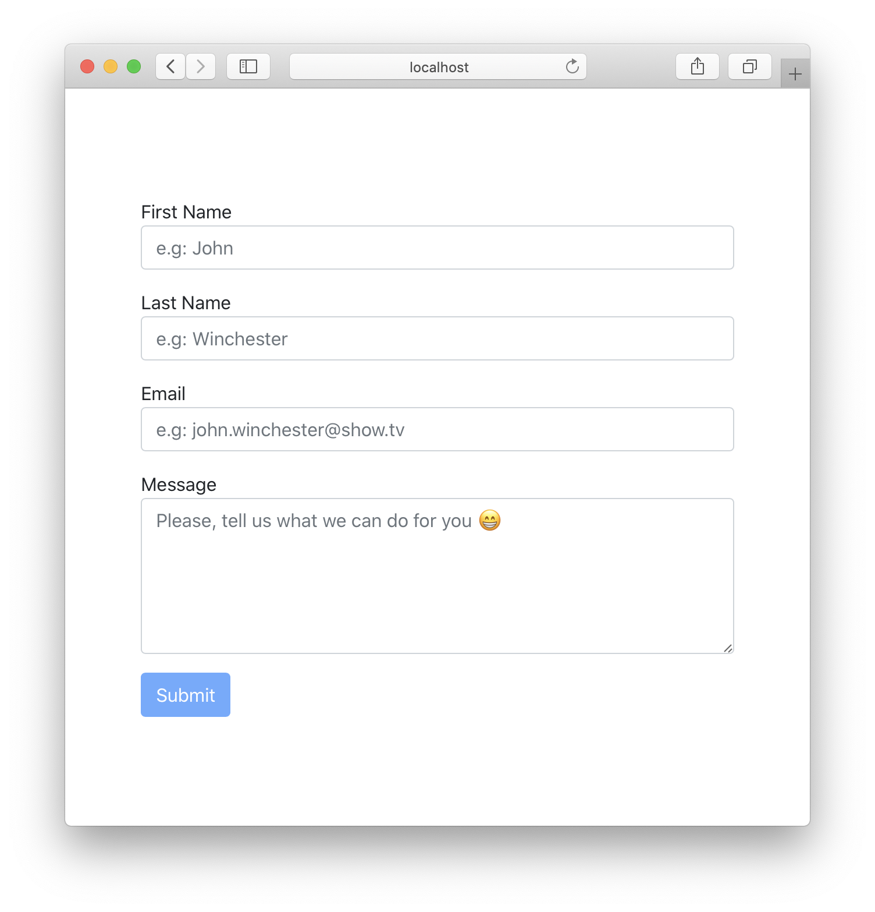
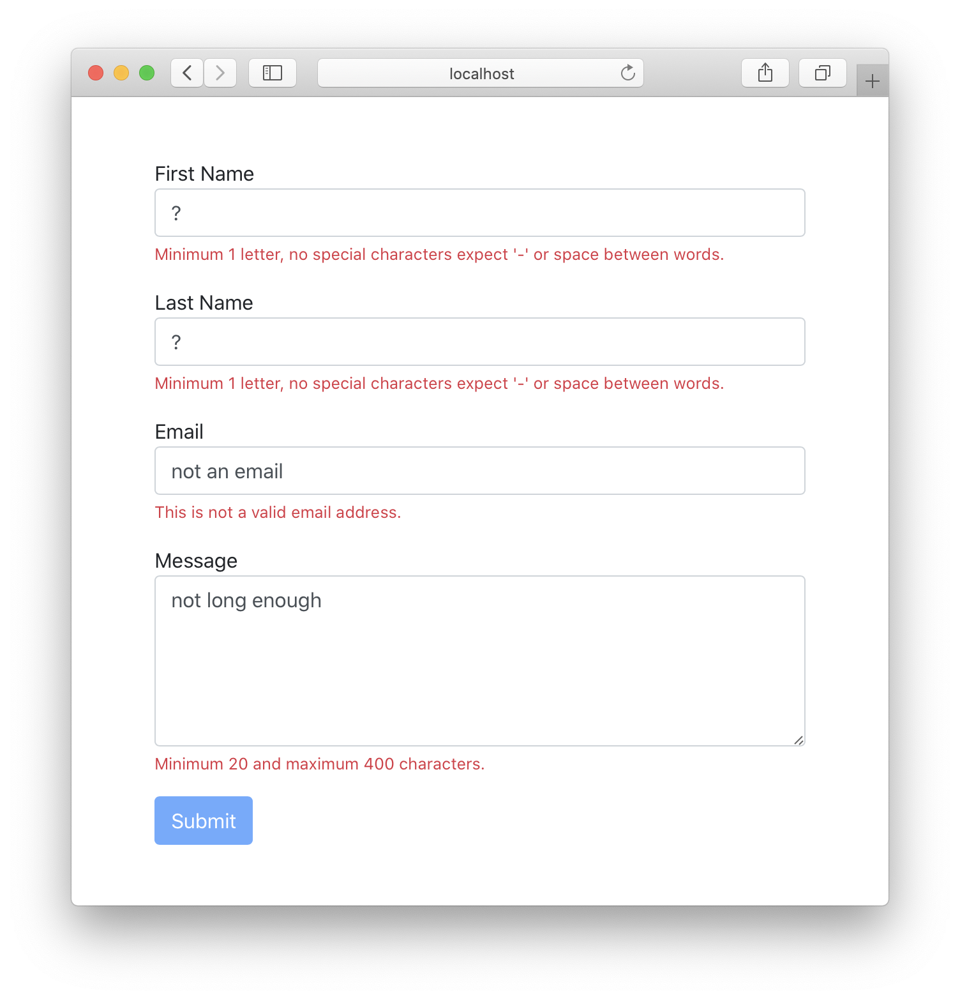
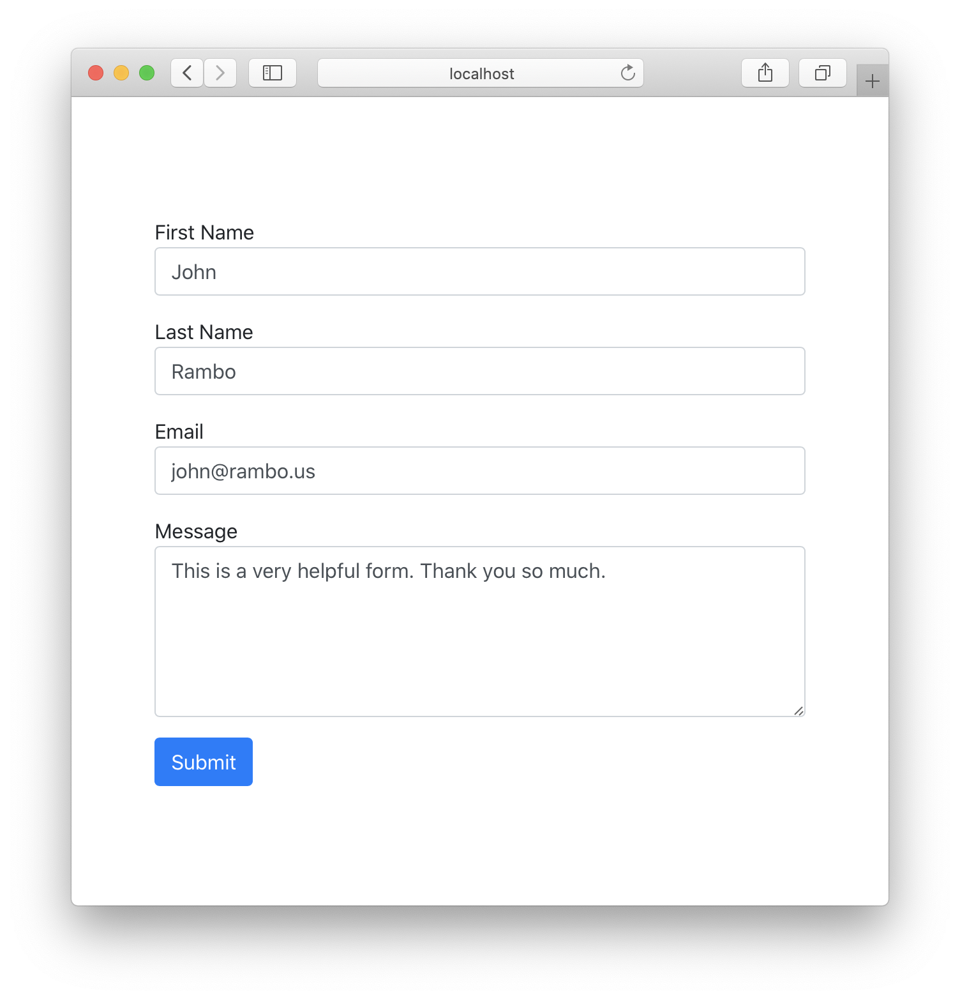

# Advanced form validations (bonus)

## Context and objectives

Forms can be tough for users.

Sometimes, we need long forms because we need to ask a lot of things to our users. It is important in these conditions, to provide them with assistance.

We need to tell them what we want in our forms and this leads us to have more complex validation systems to create.

For example:
- How many letters for a name? Often, it is two or three characters at minimum and accents are not allowed. What do we do with [Cédric O](https://en.wikipedia.org/wiki/C%C3%A9dric_O) then? 😁
- How do we handle emails? Or phone numbers?
- And so many others...

Before reading what comes after, please give a try to **[Userinyerface](https://userinyerface.com/)** so you can see what we DON'T want!

Good? 😁

Now, we need to give users some hints when they go wrong, something like that:


> Here we give hints of what we want.
>
> Note that the submit button is disabled by default. The user can't click it.


> We explain the errors under each field. It's reactive, meaning it is refreshed each time the value of the input changes.


> When all is good, the button is finaly enabled.

## Specs

Long story short. Do that ☝😁

In a more long version of it though, your code goes in `src/components/ContactForm/index.jsx`. Feel free to create new files for some part of your code, but in the end, this is the file that has to export the form component.

### Style

You should use Bootstrap for the style, don't bother writing css for each one of your components even if you can add some if you need to.

### The form

You will need to use [the `useState` React hook](https://reactjs.org/docs/hooks-reference.html#usestate) a lot.

Have also a look at [placeholders](https://developer.mozilla.org/en-US/docs/Web/HTML/Element/input#htmlattrdefplaceholder) too.

See how to enable or disable a button:
```html
<button>Enabled</button>
<button disabled="true">Enabled</button>
```

You will also need some regex to verify the value of the inputs. See how use them [in the documentation](https://developer.mozilla.org/en-US/docs/Web/JavaScript/Reference/Global_Objects/RegExp/exec#Description) and feel free to use this:

```js
const nameRegex = /^[_A-zàâäèéëêïîöôûüù]+((-|\s)*[_A-zàâäèéëêïîöôûüù])*$/gi;
const emailRegex = /^[A-Z0-9._%+-]+@[A-Z0-9.-]+\.[A-Z]{2,4}$/i;
const messageRegex = /^.{20,400}$/;
```
> You can try them on [regex101](https://regex101.com/).

## Tests

There are a few tests to help you getting started but in the end, make the best form you can!

As always `yarn start` to start the app and `yarn test` to test your code.
