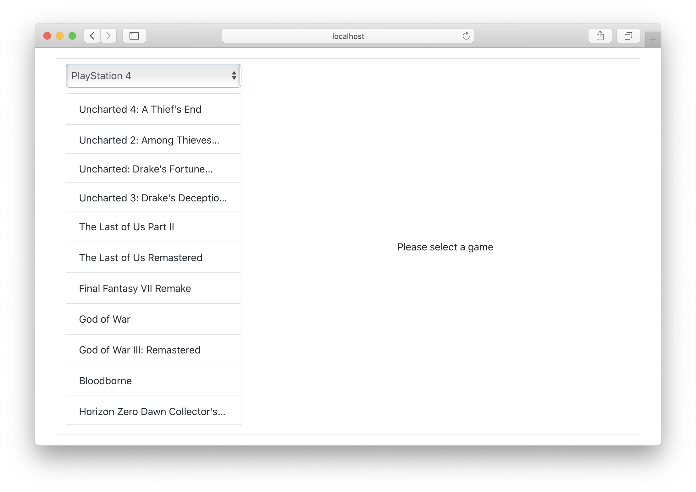
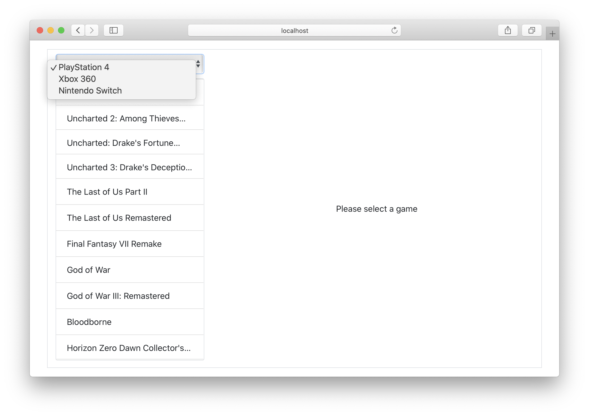
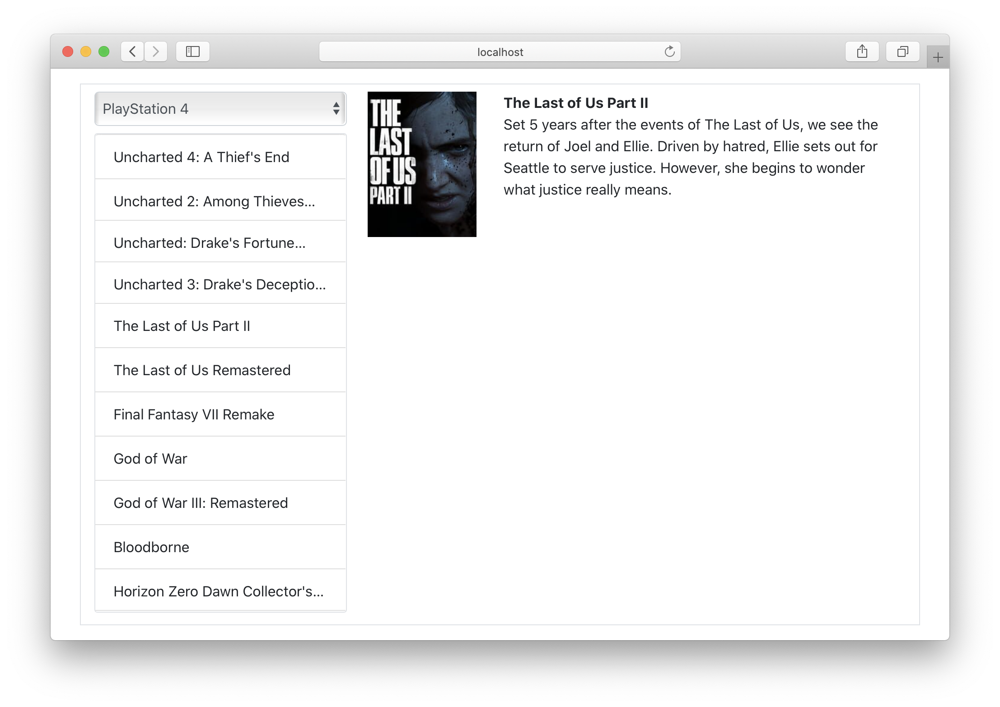

# Interact with APIs

## Context and objectives

As you've probably guessed, we will use APIs a lot when working with React. Whether `GET` requests or `POST` requests, we will communicate with APIs from our components:

- Get products information.
- Get users data.
- Send data from forms to the server.
- etc...

## Specs

In this exercise you will have to create a component that will communicate with the [Video-games api](https://videogame-api.fly.dev/).

You will only need to use these endpoints:
- `GET /platforms`
- `GET /games/platforms/<platform_id>`
- `GET /games/<id>` or `GET /games/slug/<slug>`

You will have to code inside the `src/components/PlatformPage.tsx` file.

### Get platforms data

Your component must fetch data from the platforms endpoint when it is mounted in the page inside a `useEffect` hook.

When the data is fetched, display it pretty much like this in the end:

The platforms names are used in a select tag so the user can choose between the platforms:

> Have a look at [this example](https://stackblitz.com/edit/react-select-hook).

As you can see, you also must display the associated games in a list: use [Bootstrap' list component](https://getbootstrap.com/docs/4.4/components/list-group/#basic-example) and display each game's name in a `.list-group-item` element.

When the select's value changes, you need to use the `onChange` event to present the data of the selected platform to the user. To do that, you will also need to use the `useState` hook to trigger another `useEffect`.

### Get a specific game's data

Each of your `.list-group-item` elements should handle a click event: when a game element is clicked, a request must be fired to get the selected game's information from the `/games/<id>` or `/games/slug/<slug>` endpoint.

You then have to display it:

> You need to display at least the name and the cover of the game.

### Style

Don't spend too much time to manually write css and prefer using Bootstrap to get a quick and nice style.
We only provided examples, the goal is to have a select with the platforms, a list of games that changes when we select a platform and the display of a game we selected.

How it looks is optionnal.
