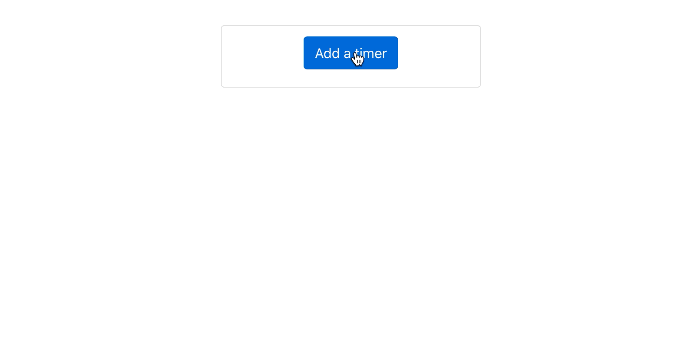

# React Timers

## Context and objectives

Learning what happens when a component is mounted or dismounted is important because it can leads to errors, especially when we use `useEffect`.

In this exercise you will have to handle this behaviour.

## Specs

You have to code two components:
- `src/components/TimersList`: a component that can handle a list of timers.
- `src/components/Timer`: a timer component wich increments time in seconds each second.

Here is an example of what it should look like:



Use this base html for your components, so you will have default style added to your elements.

```html
<ul className="list-group timers-list">
  <li className="list-group-item text-center">
    <button className="btn btn-primary">
      Add a timer
    </button>
  </li>

  <li className="list-group-item d-flex align-items-center  justify-content-between">
    <p className="text-center">X seconds</p>
    <div className="btn btn-danger">
      Delete
    </div>
  </li>
</ul>
```

### Timers list

The `Add timer` button should have a `onClick` property. The linked function should create a unique identifier for a new timer and store the list of created timers. Use `useState` to handle this part.

Then the list should display one timer per stored unique id.

### Timer

The timer component must use `useEffect`: On load the timer must be set to `0` then increment each second with `setTimeOut` and clear the timeOut in the clean part on the `useEffect`.

- [`setTimeOut` documentation](https://developer.mozilla.org/en-US/docs/Web/API/WindowOrWorkerGlobalScope/setTimeout)
- [`clearTimeOut` documentation](https://developer.mozilla.org/fr/docs/Web/API/WindowOrWorkerGlobalScope/clearTimeout#Exemples)

If you don't use `clearTimeOut` in the cleanup part of the `useEffect` hook, you'll get this error in your browser's console:

```shell
Warning: Can't perform a React state update on an unmounted component. This is a no-op, but it indicates a memory leak in your application. To fix, cancel all subscriptions and asynchronous tasks in a useEffect cleanup function.
```

## Tests

Tests are voluntarily light on this exercise. They don't check the internals of the components. You can run them with `yarn test:e2e`. They need the local server to be running, so don't forget to `yarn start` first!
